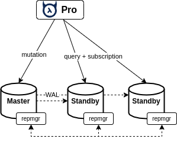

# Scaling and auto-failover Hasura with PostgreSQL

This is the test experiment of several popular PostgreSQL replication setup to know better about scaling solutions of Hasura GraphQL Engine with Postgres

This test categorizes into 2 versions: Hasura Core (OSS) and Read Replica on Hasura Pro

- [Scaling and auto-failover Hasura with PostgreSQL](#scaling-and-auto-failover-hasura-with-postgresql)
  - [Built-in Hasura features](#built-in-hasura-features)
    - [Failover multi-hosts connections](#failover-multi-hosts-connections)
    - [Read Replica](#read-replica)
  - [PostgreSQL Streaming Replication](#postgresql-streaming-replication)
    - [Hasura Core](#hasura-core)
      - [Use Cases](#use-cases)
      - [Conclusion](#conclusion)
    - [Hasura Pro](#hasura-pro)
      - [Use Cases](#use-cases-1)
      - [Conclusion](#conclusion-1)
    - [When to use](#when-to-use)
  - [PostgreSQL Replication Manager (repmgr)](#postgresql-replication-manager-repmgr)
    - [Hasura Core](#hasura-core-1)
      - [Use cases](#use-cases-2)
      - [Conclusion](#conclusion-2)
    - [Hasura Pro](#hasura-pro-1)
      - [1 Master - 1 Standby](#1-master---1-standby)
      - [1 Master - 2 Standby](#1-master---2-standby)
      - [Conclusion](#conclusion-3)
    - [When to use](#when-to-use-1)
  - [PGBouncer](#pgbouncer)
    - [Hasura Core](#hasura-core-2)
      - [Use case](#use-case)
    - [Hasura Pro](#hasura-pro-2)
      - [Conclusion](#conclusion-4)
    - [When to use](#when-to-use-2)

## Built-in Hasura features

### Failover multi-hosts connections

Because Hasura GraphQL Engine uses low level `libpq` library binding, it supports built-in failover multi-hosts connection. However, Hasura core can only connect to one PostgreSQL server one time. Some advanced feature such as Read-Write replicas is only available on Pro. 

### Read Replica

This is cool feature of Hasura Pro that supports load balancing between Master and Standby replica. All write queries are executed on Master, and read query (query, subscription) are executed on Standby node. Moreover, Hasura Pro can load balancing multiple standby nodes, therefore we can horizontally scale read queries. 
  

In this article, I will test read-replica using `Hasura Pro v1.2.1-pro.1` version 

## PostgreSQL Streaming Replication

Streaming replication in PostgreSQL works on log shipping. Every transaction in postgres is written to a transaction log called WAL (write-ahead log) to achieve durability. A slave uses these WAL segments to continuously replicate changes from its master.

- Replication type: master-slave
- Cluster setup: 1 master `pg-0`, 1 slave `pg-1`

### Hasura Core

- Docker image: [bitnami/postgresql:latest](https://github.com/bitnami/bitnami-docker-postgresql)
- Configuration: `docker-compose.postgres.yaml`

#### Use Cases

**1: stop master node (pg-0)**

- Standby node `pg-1` is still in read-only mode
- Hasura can switch to `pg-1`. However, because Hasura core require `read-write` mode, so it keep throwing transaction error `cannot set transaction read-write mode during recovery`
  
**2: start master after stopped**

- Hasura still connects to slave node `pg-1`. This is getting worse, because Hasura think that transaction error is just a normal `postgres-error` error. `pg-1` is still alive, so it can't disconnect current connection. The workaround is restarting `pg-1`

**3: restart pg-1**

- Hasura switches back to master `pg-0` in seconds

#### Conclusion

**Pros** 
- Simple to deploy and configure settings
- Used as a backup standby node that can switch to master

**Cons**
- Doesn't support auto-failover. Database admin have to switch manually
- Multi-host connections are bad choice. Hasura will be stuck at slave node if master node is downed 

### Hasura Pro
- Set `pg-1`, `pg-2` as read replica  
- Configuration: `docker-compose.pro.postgres.yaml`
  
#### Use Cases

**1: stop master node (pg-0)**

- Hasura Pro throw connection error on write replica. However read query still works
  
**2: start master after stopped**

- Hasura Pro tries connecting to `pg-0`, then continue to works

**3: stop pg-1**

- Now read queries are unreachable 

**4. add pg-0 as second read replica, then stop pg-1**

- My expectation is, if `pg-1` is downed, `pg-0` will take both role read and write. However, Hasura Pro only runs several queries then get hanging. There is conflict between repeat read and read-write ISOLATION LEVEL 

#### Conclusion

**Pros** 
- Simple to deploy and configure settings
- Used as a backup standby node that can switch to master
- Utilize power of standby node by read-replicas. Load balancing between master and standby
  
**Cons**
- Doesn't support auto-failover. Database admin have to switch manually
- Extra cost for Pro license
  
### When to use

If you use cloud SQL services (AWS RDS, Google Cloud SQL), you don't really need to care about auto-failover. Cloud providers manage server for you.
This solution is suitable for backup, or use standby node as a read-only database for read-only applications (exporter, query report...). However, with read-replica, Master node can share load pressure with Standby. 

## PostgreSQL Replication Manager (repmgr)

repmgr is an open-source tool suite for managing replication and failover in a cluster of PostgreSQL servers. It enhances PostgreSQL's built-in hot-standby capabilities with tools to set up standby servers, monitor replication, and perform administrative tasks such as failover or manual switchover operations. 

- Replication type: master-standby
- Cluster setup: 1 master `pg-0`, 1 slave `pg-1`
  
### Hasura Core

- Docker image: [bitnami/postgresql-repmgr:latest](https://github.com/bitnami/bitnami-docker-postgresql-repmgr)
- Cluster setup: 1 master `pg-0`, 1 standby `pg-1`
- Configuration: `docker-compose.repmgr.yaml`

#### Use cases

**1: stop master node (pg-0)**

- `repmgr` automatically switches standby (pg-1) to master in 30 seconds
- However, Hasura takes 2-3 minutes switching (pg-1). It works smoothly after then 

**2: start master after stopped**

- `pg-1` is still master node. `pg-0` is marked as standby

**3: repeatedly stop and start master and slave nodes**

- Hasura switches back to master faster than before (about 5 seconds)

#### Conclusion

On first time, auto-failover schedule is slow (about 3 minutes). Later times are faster. Reconnect time is dynamic because Postgres nodes need to do recovering 
  
**Pros**:
- Support automatic failover
- Simple to deploy and configure settings with docker

### Hasura Pro

#### 1 Master - 1 Standby

- Set `pg-1` as read replica  
- Hasura Pro `database-url` connects to both Postgres nodes
- Hasura Pro replicas connect to both Postgres nodes
- Configuration: `docker-compose.pro.repmgr.yaml`

**1: stop master node (pg-0)**

- `repmgr` automatically switches standby (pg-1) to master in 30 seconds
- `pg-1` takes responsibility as both write and read replica
- Hasura Pro can switch Master database URL to `pg-1`. However, it get hanging on both read and write queries because of transaction isolation conflict

**2: start master after stopped**

- `pg-1` is still master node. `pg-0` is marked as standby
- Hasura switches correct read replica and runs smoothly from now

#### 1 Master - 2 Standby

Because Hasura Pro can switch back correct read replica, we can try with 1 Master + 2 Standby setup

- Set `pg-1`, `pg-2` as read replica  
- Hasura Pro `database-url` connects to 3 Postgres nodes
- Hasura Pro replicas connect to 3 Postgres nodes
- Configuration: `docker-compose.pro.repmgr3.yaml`

**1: stop master node (pg-0)**

- `repmgr` automatically switches standby (pg-1) to master in 30 seconds
- `pg-1` takes responsibility as both write and read replica
- Hasura Pro can switch Master database URL to `pg-1`. Thank to additional read replica, Hasura Pro can solve auto-failover problem.

*Note*: `bitnami-docker-postgresql-repmgr` is focusing on Kubernetes Helm chart. Their expectation is, when master node is stop, all standby nodes except promoted one should be restarted. However, in docker environment, standby nodes can't be restarted. So Hasura Pro read replica get stuck at that standby node.

#### Conclusion

**Pros** 
- Support automatic failover
- Simple to deploy and configure settings
- Utilize power of standby node by read-replicas. Load balancing between master and standby
  
**Cons**
- There will be transaction isolation conflict when the master node is stopped 

### When to use

Auto-failover is critical on on-prem infrastructure, although Docker/Kubernetes system has auto-restart policy to reduce downtime. Read-replica works well with `repmgr`, but it is safer with 2 or more standby nodes.

## PGBouncer 

PostgrPGBouncer is used as lightweight connection pooler proxy over es. It doesn't have built-in support load balancing multiple servers or failover. We have to setup complex extensions to support them ([patroni](https://github.com/zalando/patroni), [HAProxy](http://www.haproxy.org/)...) 

How about `PGBouncer` + `repmgr`? I setup this combo to see if it works 

- Replication type: master-standby
- Cluster setup: 1 master `pg-0`, 1 slave `pg-1`
- PGBouncer setup: 2 nodes, connect to `pg-0`, `pg-1` accordingly

### Hasura Core

- Docker image: [edoburu/pgbouncer:latest](https://github.com/edoburu/docker-pgbouncer)
- Configuration: `docker-compose.pgbouncer.repmgr.yaml`

#### Use case

**1: stop master node (pg-0)**

- `repmgr` automatically switches standby (pg-1) to master in 30 seconds
- However, `pgbouncer-0` is still running. GraphQL engine can't switch to `pg-1`

**2: start master after stopped**

- Similar to Postgres replication test. `pg-0` becomes standby node now. GraphQL engine keeps showing read-write mode error 

### Hasura Pro

The behavior is similar. Hasura can't know when postgres server is stopped because it connects though PGBouncer proxy 

#### Conclusion

This architecture aren't suitable for failover connection of Hasura Core

**Pros**
- Simple to deploy and configure settings
- Lightweight connection polling, help increasing performance when there are many concurrent connections
- Utilize power of standby node by read-replicas. Load balancing between master and standby
  
**Cons**
- Don't support automatic failover
- Prevents Hasura doing auto-failover because Hasura can't detecting health status of Postgres instance.   
  
### When to use

PGBouncer can extends current streaming replication architecture, and you don't care about auto-failover or combine with advanced auto-failover and load balancer setup.
